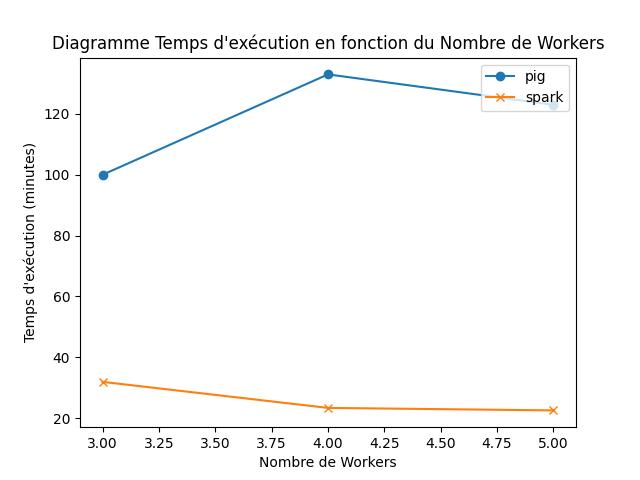

# BENCHMARK 2023 COMPARAISON PAGE RANK EN PIG ET PYSPARK

Membres de groupes : Nathan DESHAYES, Nihel BELHADJ KACEM et Mathis EMERIAU

## Description du projet
Le but de cette expérience c'est de comparer les performances de l'algorithme pagerank, entre une implémentation Pig et une implémentation PySpark.

Ici nous allons tester avec plusieurs configurations de cluster --> 3 noeuds, 4 noeuds, 5 noeuds.

Premièrement, nous présentons les configurations utilisées pour réaliser cette expérience [Configuration et execution](#configuration), ensuite nous comparons les temps d'exécution du pagerank avec des diagrammes à ligne brisée  [Pig VS Pyspark](#PgVSps). Finalement, nous illustrons les meilleurs pagerank computés [P Les top 5 Résultats des pageranks:](#top5). 

<a id="configuration" style="color: black;">

## Configuration et execution </a>
- Espace disque machine attribuée (maître/workers) : 500Mo d'espace disque
- La région où les clusters ont été utilisés est europe-central2. 

### Partie Pyspark :

Le fichier "run.sh" permet d'exécuter le pagerank sur un cluster à 4 workers. Pour le faire fonctionner et changer le nombre de workers, il faut changer le paramètre "num-workers" dans la commande de création du cluster (ligne 16) et changer les noms du paramètre "project" et du bucket pour mettre les siens à la place.

Le fichier "pagerank_notype.py" calcule 3 itérations de pagerank pour chaque ligne, sauvegarde les résultats sur le bucket et calcule le temps d'exécution total du pagerank avant de l'afficher en console.

Le fichier "récupèreTop5.py" prend en entrée les résultats de pagerank d'une exécution d'un cluster puis affiche en console les 5 meilleurs valeurs de pagerank.

### Partie Pig :

Le fichier [run_all_pig.py](./pig/run_all_pig.py) permet de lancer les exécutions afin de varier le nombre de noeuds (workers) à chaque fois. Il appelle à chaque exécution [run_pig.sh](./pig/run_pig.sh). Si vous voulez tester de ne lancer qu'une exécution avec 2 noeuds, il y a : [run_2_workers_pig.py](./pig/run_2_workers_pig.py).

Le fichier [run_pig.sh](./pig/run_pig.sh) permet de lancer le cluster qui va exécuter [dataproc.py](./pig/dataproc.py). C'est ici qu'il faut indiquer votre nom de projet, et votre bucket pour l'exécution. Les lignes de commandes qui permettent de copier les fichiers nécessaires à l'exécution sont en commentaires car on suppose que les fichiers ont déjà été copiés dans le bucket. Veillez à les remettre si nécessaire.

Le fichier [dataproc.py](./pig/dataproc.py) est celui qui va exécuter le code pig afin de calculer le page rank. On réalise 3 itérations pour le calcul et il crée un fichier texte afin de sauvegarder le temps d'exécution dans le bucket. On récupérera ensuite cette ligne et on l'insérera à la fin de [time_results.txt](./pig/time_results.txt) pour avoir le temps d'éxécution de chacune des exécutions sur le projet. À la fin du calcul du page rank, on récupére les 5 premiers page rank dans le bucket que l'on va récupérer pour les mettre dans le projet dans le fichier [pig_top_page_rank.txt](./pig/pig_top_page_rank.txt).

<a id="Tempsexec" style="color: black; ">

## Temps d'exécution </a>

### Partie Pyspark : 
- 3 workers : 31,91 minutes
- 4 workers : 23,35 minutes
- 5 workers : 22,53 minutes

### Partie Pig :
- 3 workers : 41,733 minutes
- 4 workers : 35,3833 minutes
- 5 workers : 33,05 minutes
<a id="PgVSps" style="color: black; ">

## Pig VS Pyspark </a>
Ci-après suit un diagramme à ligne brisée illustrant la comparaison des temps d'exécution entre les implémentations pagerank, pour chaque configuration de cluster utilisée:

Sur ce graphique nous pouvons constater les points suivants:

- Pig est l'implémentation la moins performante avec peu des noeuds, ce qui pourrait s'expliquer par les écritures des résultats intermediaries sur le disque avec des ressources limitées.
- PySpark avec du partitionnement est l'implémentation qui performe le mieux en moyen, néanmoins cette implémentation atteint un seuil à 4 noeuds.
- Pig bénéficie le plus de l'augmentation du nombre de noeuds, ce qui devient plus évident dans le range de 4 à 5 noeuds. Nous pouvons apprécier que les implémentations sur PySpark atteignent un seuil dans leurs temps d'exécution dans cette range de 4 à 5 noeuds, tandis que le temps d'exécution continue à diminuer pour Pig.
- L'implémentation sur Pig rattrape l'implémentation sur PySpark Basic pour la configuration à 5 noeuds.
- Avec des ressources limitées (2 noeuds), Pyspark ne semble pas bénéficier d'une amélioration en raison du partionnement.
Les meilleurs pagerank computés dans le cadre de ces exécutions sont présentés dans la section suivante.
<a id="top5" style="color: black; ">

## Les top 5 Résultats des pageranks: </a>
Nous avons obtenu que l'entité avec le meilleur pagerank c'est l'uri http://dbpedia.org/resource/Living_people, avec un pagerank de 36,794.33. On présente ci-après le top 5 des uris ayant le meilleur pagerank issus de l'implémentation Pyspark, avec 3 itérations de l'algorithme pagerank:
| Rank| URL | PageRank |
| :----: | :---: | :---: |
| 🥇 | <http://dbpedia.org/resource/Living_people>  | 36794.33146754654 |
| 🥈 | <http://dbpedia.org/resource/United_States> | 13201.340151981207 |
| 🥉 | <http://dbpedia.org/resource/Race_and_ethnicity_in_the_United_States_Census> | 10371.162005541348 |
| 4 | <http://dbpedia.org/resource/List_of_sovereign_states> | 5195.347361862185 |
| 5 | <http://dbpedia.org/resource/United_Kingdom> | 4923.821309315207 |

Les liens produits par l'implémentation PIG restent inchangés, toutefois, les valeurs du PageRank diffèrent. 
Nons  pouvons l'illustrer dans un tableau similaire à celui précédent, mais en incluant les résultats du PageRank obtenus via l'implémentation PIG:

 | Rank | URL | PageRank |
| :----: | :---: | :---: |
| 🥇 | ... | 33320.508 |
| 🥈 | ... | 15212.145 |
| 🥉 | ... | 11309.122 |
| 4  | ... | 5373.2163 |
| 5  | ... | 5044.9463 |

